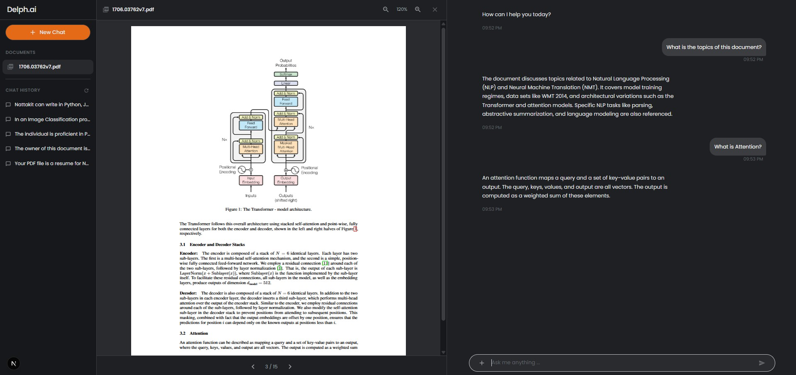
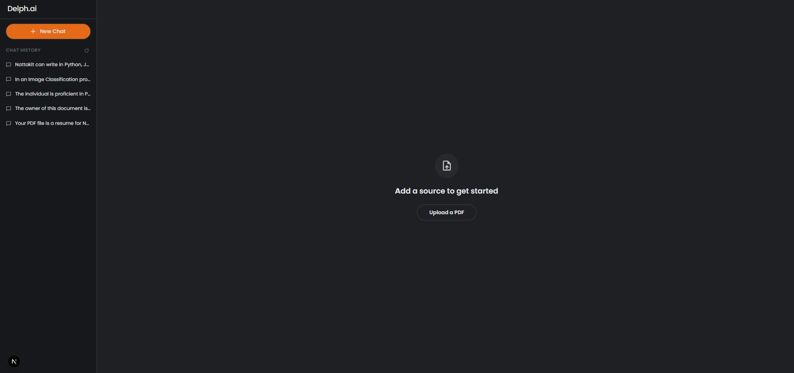

# Delph.ai — Chat with your PDFs

<p align="center">
  <strong>RAG (Retrieval-Augmented Generation) application that lets you upload PDF documents and have AI-powered conversations about their content.</strong>
</p>

Built with **Google Gemini**, **LangChain**, **FastAPI**, and **Next.js**.

---

## Screenshots

<p align="center">
  
</p>
<p align="center">
  
</p>

---

## Features

- **PDF Upload & Ingestion** — Upload PDF files, automatically split into chunks and stored in a FAISS vector database
- **AI Chat with Context** — Ask questions about your documents using Google Gemini with relevant context retrieved from the vector store
- **Session Management** — Each conversation has its own session with isolated vector stores and chat history
- **Chat History** — All conversations are persisted in MongoDB and accessible from the sidebar
- **PDF Preview** — View uploaded PDFs inline with page navigation and zoom controls
- **Dark Theme UI** — Modern, polished dark interface built with MUI

---

## Architecture

```
┌─────────────────────┐         ┌─────────────────────────────┐
│    Next.js Frontend  │         │      FastAPI AI Server      │
│    (Port 3000)       │         │      (Port 8888)            │
│                      │         │                             │
│  ┌────────────────┐  │  HTTP   │  ┌───────────────────────┐  │
│  │ API Routes     │──┼────────►│  │ /upload               │  │
│  │ /api/upload    │  │         │  │ /chat                 │  │
│  │ /api/chat      │  │         │  │ /sessions             │  │
│  │ /api/sessions  │  │         │  │ /sessions/{id}        │  │
│  └────────────────┘  │         │  └───────┬───────────────┘  │
│                      │         │          │                  │
│  ┌────────────────┐  │         │  ┌───────▼───────────────┐  │
│  │ React UI       │  │         │  │ LangChain RAG Chain   │  │
│  │ Chat, Sidebar, │  │         │  │ Google Gemini Pro     │  │
│  │ PDF Preview    │  │         │  │ HuggingFace Embeddings│  │
│  └────────────────┘  │         │  └───────┬───────────────┘  │
│                      │         │          │                  │
└─────────────────────┘         │  ┌───────▼──┐  ┌─────────┐  │
                                │  │  FAISS   │  │ MongoDB │  │
                                │  │ (vectors)│  │ (history)│  │
                                │  └──────────┘  └─────────┘  │
                                └─────────────────────────────┘
```

---

## Project Structure

```
rag-app/
├── ai/                          # AI Server (Python / FastAPI)
│   ├── app/
│   │   ├── api/routes/          # API endpoints (chat, document, session)
│   │   ├── config/              # Environment & app configuration
│   │   ├── core/                # RAG chain, prompts, memory
│   │   ├── ingestion/           # PDF loading & text splitting
│   │   ├── models/              # Pydantic request/response models
│   │   ├── utils/               # Logger
│   │   ├── vector_store/        # FAISS vector store management
│   │   └── main.py              # FastAPI app entry point
│   ├── faiss_index/             # Persisted vector store data
│   ├── .env                     # Server environment variables
│   └── pyproject.toml           # Python dependencies (uv)
│
└── frontend/rag-app/            # Frontend (Next.js / TypeScript)
    ├── app/
    │   ├── api/                 # Next.js API route proxies
    │   │   ├── chat/route.ts
    │   │   ├── upload/route.ts
    │   │   └── sessions/route.ts
    │   ├── chat/[sessionId]/    # Dynamic chat page
    │   ├── layout.tsx           # Root layout (fonts, theme)
    │   └── page.tsx             # Home page (upload prompt)
    ├── components/
    │   ├── features/            # Chat, ChatHistory, PdfPreview
    │   ├── layout/              # LayoutWrapper, Sidebar
    │   └── ErrorBoundary.tsx
    ├── hooks/                   # Custom hooks (useFileUpload)
    ├── providers/               # DocumentContext, MuiThemeProvider
    ├── styles/                  # Theme tokens, global CSS
    └── types/                   # TypeScript interfaces
```

---

## Prerequisites

| Tool | Version | Purpose |
|------|---------|---------|
| **Python** | ≥ 3.12 | AI server runtime |
| **uv** | latest | Python package manager |
| **Node.js** | ≥ 18 | Frontend runtime |
| **npm** | ≥ 9 | Frontend package manager |
| **MongoDB** | ≥ 6.0 | Chat history storage |
| **Google API Key** | — | Access to Gemini models |

---

## Getting Started

### 1. Clone the repository

```bash
git clone https://github.com/Robininyourarea/rag-app.git
cd rag-app
```

### 2. Set up the AI Server

```bash
cd ai

# Install dependencies
uv sync

# Create .env file
copy .env.example .env   # Windows
cp .env.example .env     # macOS/Linux
```

Edit `ai/.env` with your credentials:

```env
GOOGLE_API_KEY=your-google-api-key
MONGO_INITDB_ROOT_USERNAME=your-mongo-username
MONGO_INITDB_ROOT_PASSWORD=your-mongo-password
MONGO_INITDB_DATABASE=rag_db
MONGODB_HOST=localhost
MONGODB_PORT=27017
```

Start the server:

```bash
uv run uvicorn app.main:app --host 0.0.0.0 --port 8888 --reload
```

### 3. Set up the Frontend

```bash
cd frontend/rag-app

# Install dependencies
npm install

# Create .env file (if not exists)
echo AI_SERVER_URL=http://localhost:8888 > .env
```

Start the dev server:

```bash
npm run dev
```

### 4. Open the app

Navigate to **[http://localhost:3000](http://localhost:3000)** in your browser.

---

## 📡 API Endpoints

| Method | Endpoint | Description |
|--------|----------|-------------|
| `POST` | `/upload` | Upload a PDF file and ingest into vector store |
| `POST` | `/chat` | Send a query with `session_id` and get AI response |
| `GET` | `/sessions` | List all chat sessions with previews |
| `GET` | `/sessions/{session_id}` | Get chat history for a session |
| `DELETE` | `/sessions/{session_id}` | Clear a session's chat history |

API documentation (Swagger UI): **[http://localhost:8888/docs](http://localhost:8888/docs)**

---

## Tech Stack

### AI Server
- **FastAPI** — High-performance async web framework
- **LangChain** — RAG chain orchestration
- **Google Gemini Pro** — LLM for answer generation
- **HuggingFace Embeddings** — Text embedding for vector search
- **FAISS** — Vector similarity search (session-isolated stores)
- **MongoDB** — Chat history persistence
- **PyPDF** — PDF text extraction

### Frontend
- **Next.js 16** — React framework with App Router
- **React 19** — UI library
- **MUI 7** — Material Design component library
- **Emotion** — CSS-in-JS styling
- **react-pdf** — In-browser PDF rendering
- **TypeScript** — Type safety

---

## How It Works

1. **Upload** — User uploads a PDF → Frontend sends it to `/api/upload` → Next.js proxy forwards to FastAPI → PDF is split into chunks → Chunks are embedded and stored in a session-specific FAISS index
2. **Chat** — User sends a message → Frontend calls `/api/chat` with the session ID → FastAPI retrieves relevant chunks from FAISS → LangChain builds a prompt with the retrieved context + chat history → Gemini generates an answer → Response is returned and chat history is saved to MongoDB
3. **History** — Sidebar fetches `/api/sessions` to show past conversations → Clicking a session loads its messages from MongoDB

---

## License

This project is for educational and personal use.
